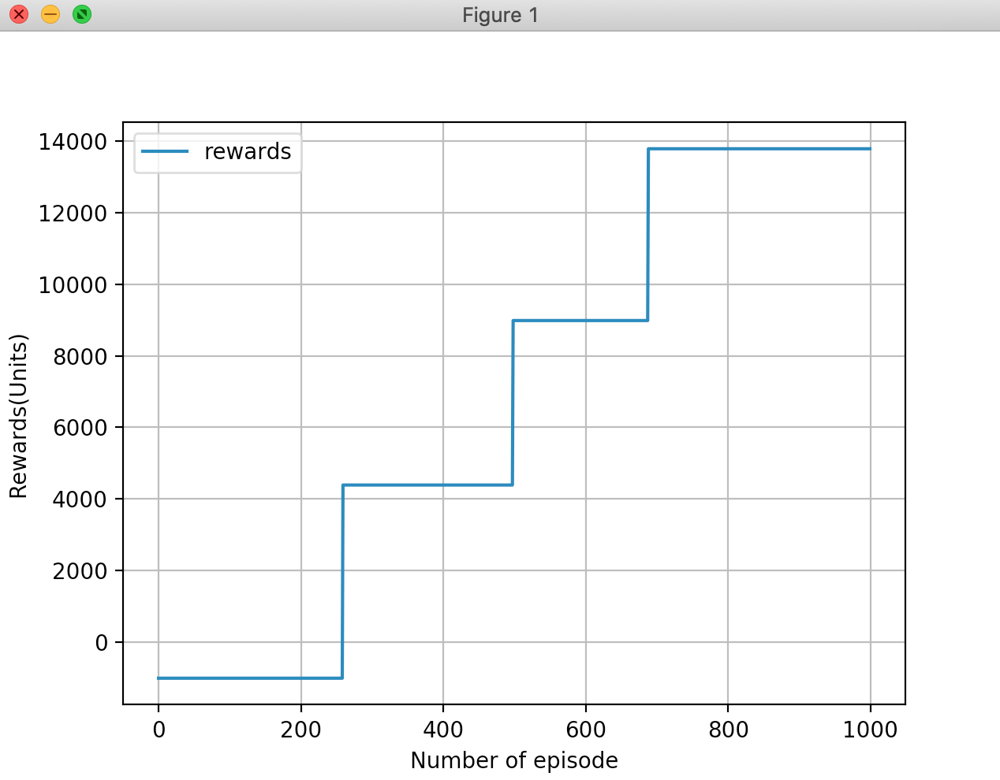
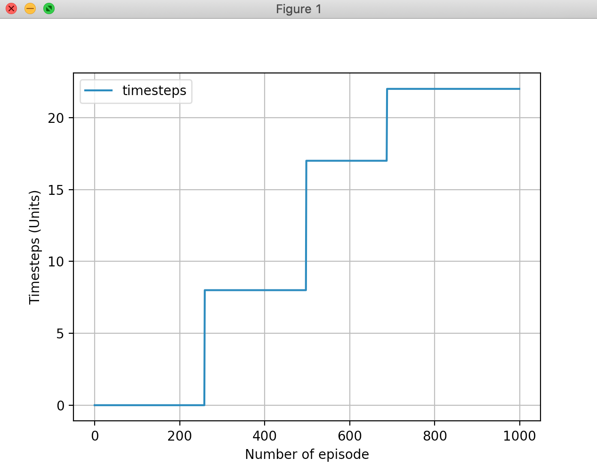

# QLearning Program to train an agent efficient lane changing 
Nagel Schreckenberg Cellular Automata Model for training an agent to make efficient lane change decisions using Q Learning Algorithm. 

## Description
This program has three main objects - car, road, and representation. The representation object deals with interactive mode, while the road and car classes make up the environment for the simulation. The road has three lanes with each lane having 100 cells, the road is modeled as a circular road (periodic boundary conditions). The simulation starts with 99 HVs with well defined properties randomly distributed on the road, 1 agent is also distributed randomly in the same road. Each update of the system involves each car object making lane change decisions followed by longitudinal update. The agent uses QLearning algorithms to learn the optimal lane change policy that would reduce the time taken for it to make 10 cycles on the road.

## Installation

Use the package manager [pip](https://pip.pypa.io/en/stable/) to install pygame, matplotlib and any other packages that you may be missing on your system

```bash
pip install pygame
```
## Default Mode
This version has the following simulation conditions
```bash
Total Number of cars: 100
Maximum speed on road: 5
Maximum AV-AV speed: 3
Maximum AV-HV speed: 3
Maximum HV speed: 3
Probability of lane change of AV: 0.6
Probability of lane change of HV: 0.6
Probability of braking of AV: 0.4
Probability of braking of HV: 0.4
Number of AVs: 1
Simulation Terminates at (cycles): 10
Random seed is fixed at  4
Maximum Time Steps: 2000
```
The default parameters used for qlearning are as below:
```python
  #define parameters 
  num_episodes = 100
  max_steps_per_episode = 2000
  learning_rate = 0.1 
  discount_rate = 0.99
  exploration_rate = 1 
  max_exploration_rate = 1 
  min_exploration_rate = 0.01
  exploration_decay_rate = 0.005
```

## QState 
Matrix composed of 300 rows and 3 columns.
The rows correspond to the state space (300 grids in the road data structure).
The columns correspond to the action space (change lane up, change lane down, do not change lane)

## Reward Function Logic
The current version of the program has the reward function working as follows:
New version of reward function logic is as follows. 
```python
action is passed as input to the function guiding the agent's lane change dynamics
    if action results in agent moving to an occupied lane ->  end episode and  high penalty
    if action leads to empty block and safe for moving -> good reward
    if action leads to safety and better v_potential -> highest reward
    if action leads to not changing lane and lane change was not possible -> good reward

for each cycle completed, c, record time taken, t.
        rewards += constant * ( cycle_distance / t)
        -> this would incentivize agent to increase its average speed more
        -> this would also make sure that it completes more cycles
```
Once, the aggregate reward is calculated using the above code block. The final reward for the episode is calculated as follows:
```python
final_reward = aggregate_reward - timesteps_taken_to_complete_10_cycles
```
## Customization
In order to change the simulation condition, edit the file "config\case.py". 
```python
  9 #sim data
 10 data = ["trial.txt",100,5,3,3,3,0.6,0.6,0.4,0.4,1,10]

"""
order of data:
 ["Output file name: ","Total Number of cars: ", "Maximum speed on road: ",
 "Maximum AV-AV speed: ", "Maximum AV-HV speed: ",     
"Maximum HV speed: ", "Probability of lane change of AV: ", 
"Probability of lane change of HV: ", "Probability of braking of AV: ", 
"Probability of braking of HV: ", "Number of AVs: ","Simulation Terminates at (cycles): "] 
"""
```
In order to change the qlearning parameters, edit respective variables in the "driver.py" file. To change the environment conditions change the "simulation/road.py" file and to change agent/other car behaviors, reward functions change the "simulation/car.py" file. 

Important methods in road.py: 
```python
self.step(act) , self.setEnvironment(totalCars,agentNum) and the constructor
```
Important methods in car.py:
```python
self.qUpdateLane(act) , self.agentLaneChange(act), self.allocateReward() and 
the constructor
```

## Usage
In your shell, execute the following code
```bash
python3 driver.py
```
## Learning Statistics
The program records the rewards, qvalues, and timesteps associated with each episode and upon termination creates a text file with these key statistics and generates two plots - rewards vs episodes, and timesteps vs episodes

## Results from 1000 training episode



## TO DO LIST:
- [x] Update Reward Function
- [ ] Include a parameter to adjust the cooperation vs aggressive nature of the agent
- [ ] Identify Best Learning Parameters with respect to simulation time 
- [ ] Identify Best Learning Parameters with respect to rewards
- [ ] Train Model on HPCC Network
- [ ] Moving average, min, max, over range stats plot for rewards update
- [ ] Infer Probability(lane change) from training data 
- [ ] Incorporation of visual sim in training 
- [ ] Implement any change Dr. Li suggests
- [ ] Reducing the state space to only that of the neighboring cells of the agent
- [ ] Incorporation of random seed

## ISSUES:
- [ ] None type return of reward
- [ ] Factoring in time of lap into rewards

# New Model/Idea (Needs Implementation)

## New State Space

## New Q Table

## New Environment

## Cases and Resolution (Reward Allocation)

## New Training Plan

## New To Do/Functionality List

## Study Results/Findings/Questions

